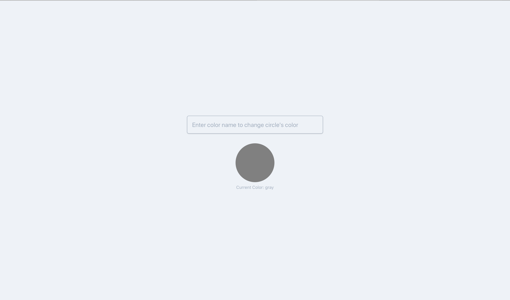

# Circle

A simple input that takes color, and a circle that changes to that color

 

 

# To run on localhost

`git clone git@github.com:roguesherlock/react-doctype.git`

`cd react-doctype`

`yarn install`

`yarn start`
